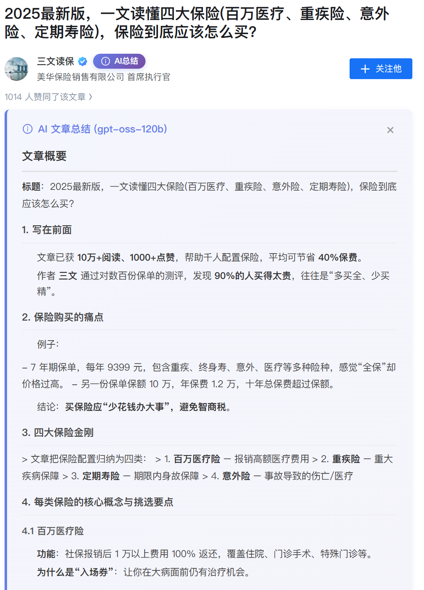
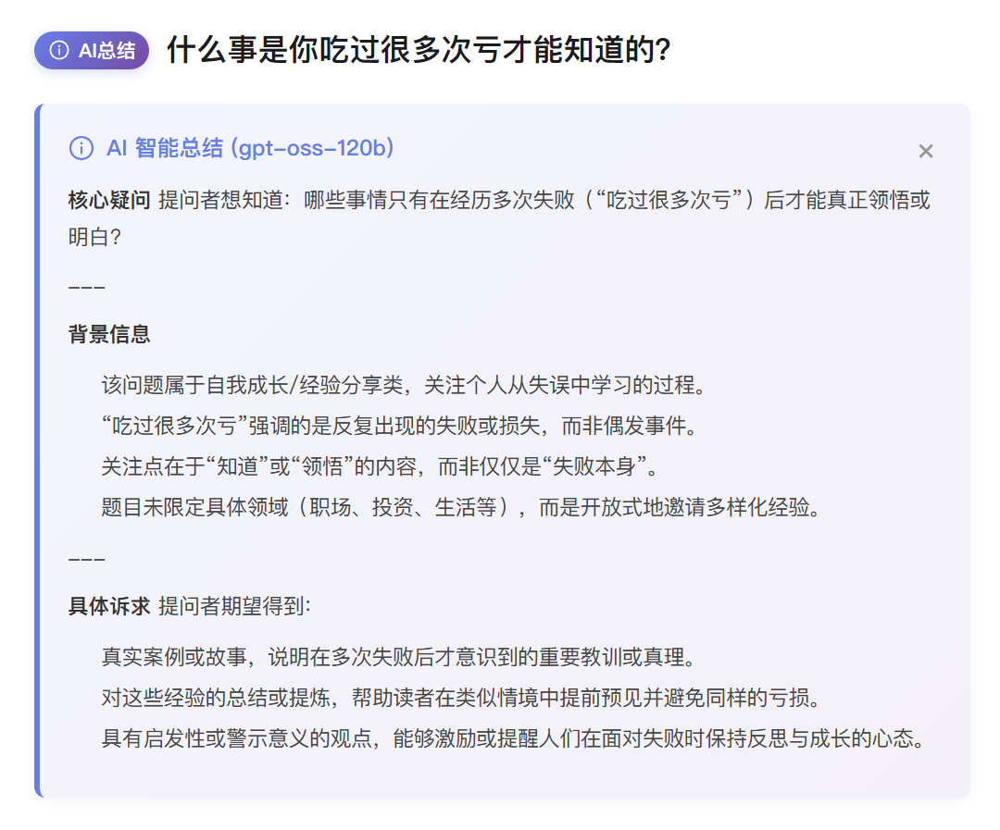
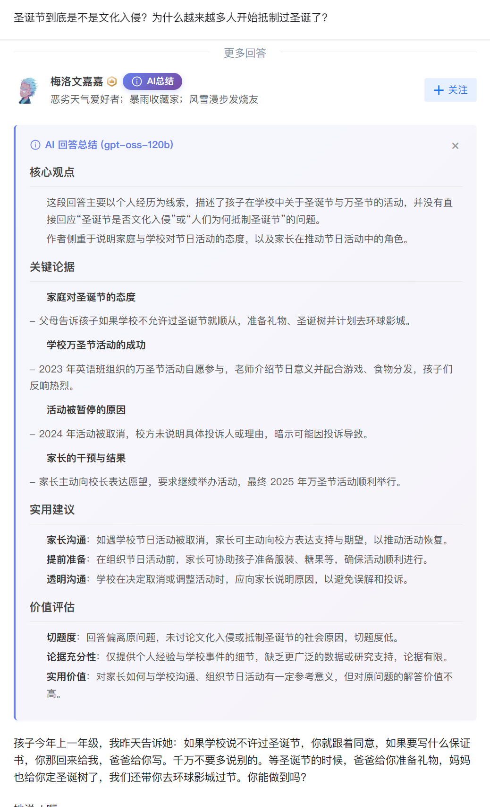

# 知乎AI总结助手

一个强大的油猴脚本，为知乎文章、问题和回答添加AI总结功能，使用ChatGPT进行智能内容总结。

## 安装
- [一键安装油猴脚本](https://greasyfork.org/zh-CN/scripts/559782-%E7%9F%A5%E4%B9%8Eai%E6%80%BB%E7%BB%93%E5%8A%A9%E6%89%8B?locale_override=1)
- [安装浏览器扩展版](https://github.com/summer-8848/zhihu-ai-summary-extension)

## 功能特点

- **多场景支持**：支持知乎文章、问题描述、回答内容的AI总结
- **智能总结**：调用OpenAI ChatGPT API，提供高质量的内容摘要
- **美观界面**：精心设计的UI，包括渐变按钮、优雅的弹窗和加载动画
- **易于配置**：可视化配置界面，一键保存API Key
- **自动适配**：自动检测页面类型，为不同内容添加相应的总结按钮

### 文章总结

### 问题总结

### 回答总结

